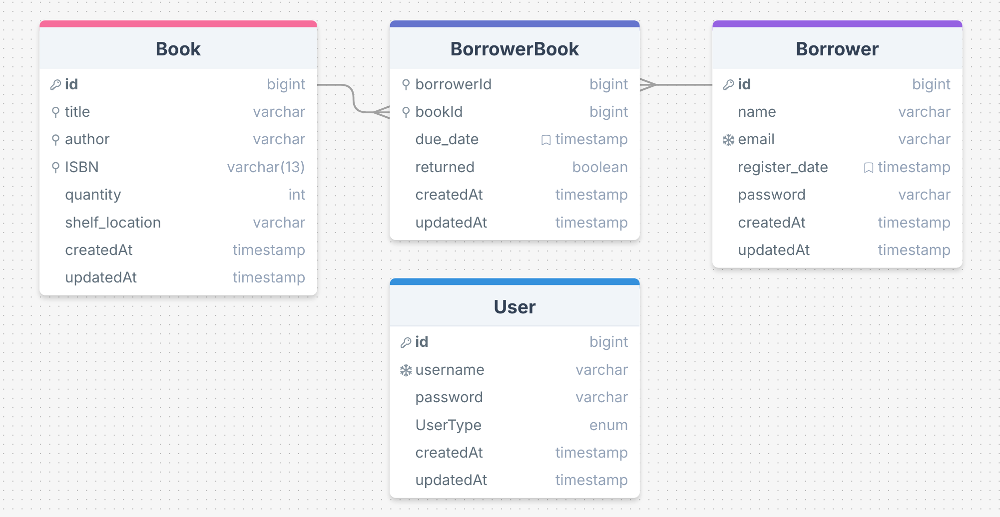

# Library Management System

# How to start the application

1. Run the application

    ```bash
    docker compose up --build    
    ```

2. stop the application
    ```bash
    docker compose down
    ```

## Assumptions

Here I will make some assumptions for the system

1. System Users
    1. SystemUser: can access, add or update resources
    2. Admin: can access, add, update and delete resources and add new system User
2. Borrower : borrow a book, return a book, list all borrowed books
3. ISBN-13 (need 17 chars, 4 hyphens) e.g. 789-0-12-999111-2
4. Shelf Location will user varchar for simplicity


## Database Schema


### Indexes
1. Book.title, Book.author, Book.ISBN for high search performance
2. (BorrowerBook.borrowerId, BorrowerBook.bookId) to enable fast checkout and return books, fast listing borrowed book.
3. suggestion: adding index on (returned and duedate) if listinbg overdue books is a frequent operations.

## Project structure
```
.
├── Error
│   ├── ErrorHandler.js
│   ├── LoginError.js
│   └── NotFoundError.js
├── README.md
├── app.js
├── assets
│   └── schema.png
├── config
│   ├── app.config.js
│   ├── db.config.js
│   ├── index.js
│   └── logger.config.js
├── controllers
│   ├── BookController.js
│   ├── BorrowerBookController.js
│   ├── BorrowerController.js
│   └── UserController.js
├── database
│   └── database.js
├── docker-compose.yml
├── logger
│   └── logger.js
├── logs
│   ├── errors.log
│   └── logs.log
├── middlewares
│   ├── RateLimiter.js
│   └── jwt.js
├── models
│   ├── Book.js
│   ├── Borrower.js
│   ├── BorrowerBook.js
│   └── User.js
├── package-lock.json
├── package.json
├── routes
│   ├── BookRoutes.js
│   ├── BorrowerBooksRoutes.js
│   ├── BorrowerRoutes.js
│   ├── UserRoutes.js
│   └── index.js
└── services
    ├── bookService.js
    ├── borrowBookService.js
    ├── borrowerService.js
    └── userService.js
```
## Implementation

### SQL Injection

Handle sql injection by :- 
1. using paramterized queries and avoiding raw queries

    ```javascript
        const books = await Book.findAll({
            where: {
                [Op.or]: [
                    { title: { [Op.like]: `%${query}%` } },
                    { author: { [Op.like]: `%${query}%` } },
                    { ISBN: query }
                ]
            }
        });
    ```

2.  validate inputs

    ```javascript
        check('title').notEmpty().withMessage('Title is required'),
        check('author').notEmpty().withMessage('Author is required'),
        check('ISBN').notEmpty().withMessage('Invalid ISBN'),
        check('quantity').isInt({ min: 0 }).withMessage('Quantity must be a non-negative integer'),
        check('shelfLocation').optional().isString().withMessage('Shelf Location must be a string')
    ```

### Error handler
Implement a Global Error Handler and custom Errors for :

1. Centralized Error Management: Handles all errors in one place, reducing redundancy.
2. Consistent Responses: Ensures uniform error response format across the application.
3. Maintenance Efficiency: Simplifies code maintenance by reducing the need for repetitive error handling.
4. Separation of Concerns: Keeps error handling logic separate from business logic.

    ```javascript
    const errorHandler = (err, req, res, next) => {
        let statusCode = err.statusCode || 500;
        let message = err.message || "Internal Server Error";

        if (err instanceof ValidationError) {
            statusCode = 400;
            message = err.message;
        } 
        else if (err instanceof DatabaseError) {
            statusCode = 500;
            message = err.message;
        }
        else if (err instanceof LoginError || err instanceof NotFoundError) {
            statusCode = err.statusCode;
            message = err.message
        }

        logger.error("Error Handler catches an exception: " + message)
        res.status(statusCode).json({
            status: 'error',
            statusCode,
            message,
        });
    }
    ```

### Logger

Add a logger for better error Tracking, monitoring, debugging

```javascript
    const logger = createLogger({
        level: 'info',
        format: format.combine(
            format.timestamp(),
            format.printf(({ timestamp, level, message }) => {
                return `${timestamp} ${level}: ${message}`;
            })
        ),
        transports: [
            new transports.Console(),
            new transports.File({ filename: config.logger.log_error_path, level: 'error' }), 
            new transports.File({ filename: config.logger.log_path })
        ]
    });
```

### RateLimitting

Using the `express-rate-limit` package for:
1. Easy Setup: Quickly adds rate limiting to the application.
2. Customizable: Lets you configure limits based on your needs.

    ```javascript
    const checkoutLimiter = rateLimit({
        windowMs: 60 * 1000,  // 1 minute
        max: 10,
        message: 'Too many requests for checkout, please try again later.',
    });


    const returnLimiter = rateLimit({
        windowMs: 60 * 1000,  // 1 minute
        max: 30,
        message: 'Too many return requests, please try again later.',
    });
    ```

### JWT
JWT (JSON Web Tokens) to Implement basic authentication for the API.